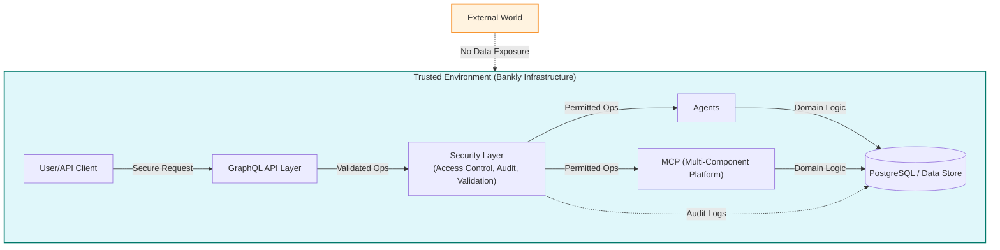

# Bankly

**Version:** <!-- VERSION_PLACEHOLDER -->

Bankly is a self tech testing project, scaled up by strategic acceleration using a configured environment of multiple agents and MCP. The security layer ensures that using agents or MCP is not a security or GDPR risk: all sensitive data and operations remain within secure, controlled boundaries, with no external data exposure or unauthorized access. Agents and MCP operate only within the trusted environment, with strict access controls and auditability, so there is no risk of data leakage or non-compliance.

> **Note:** The security and GDPR guarantees described above apply when Bankly is deployed in a properly secured production environment. For local development or testing, always use mock or anonymized data and ensure your environment is configured to prevent unauthorized access or data leakage.



Built with Node.js, TypeScript, and functional programming principles using fp-ts, Bankly supports secure money transfers between user accounts, tracks transaction history, and publishes domain events via Kafka — all wrapped with robust CI/CD pipelines and comprehensive documentation.

## 📌 Summary
Bankly is a functional, event-driven banking backend built with modern TypeScript, designed to demonstrate senior software engineering capabilities — from architecture and validation to event processing and CI/CD automation.

It simulates real-world financial use cases and shows expertise in building scalable, reliable, and testable back-end systems — suitable for fintech companies, startups, and enterprise APIs.

---

## Key Features

| Area                | Feature                                                                 |
|---------------------|-------------------------------------------------------------------------|
| 💼 Banking Domain   | Transfer money, validate accounts, and track balances                   |
| ✅ Functional Core  | Built using fp-ts, io-ts, and TaskEither for pure, composable logic     |
| 📦 GraphQL API      | Exposes typed operations with runtime validation                        |
| 🛢️ PostgreSQL + Prisma | ACID-safe persistence layer for accounts and transactions           |
| 📣 Kafka Events     | Emits MoneyTransferred events for external systems (logging, auditing, notifications) |
| 🔬 Testing Suite    | Includes unit tests, integration tests, and type-safe mocks             |
| ⚙️ CI/CD            | GitHub Actions pipeline with linting, tests, and build checks           |
| 📚 Documentation    | Full API schema, architectural overview, and event contracts            |
| 🛡️ Security Focus   | Immutable domain objects, strict type validation, no unsafe casting     |

---

## 🧠 Technologies Used
- **Language:** Node.js + TypeScript
- **Functional Tools:** fp-ts, io-ts, zod
- **Database:** PostgreSQL (via Prisma ORM)
- **API Layer:** Apollo GraphQL Server
- **Messaging:** KafkaJS
- **CI/CD:** GitHub Actions + Docker
- **Testing:** Jest, Supertest, Fast-check
- **Architecture:** Hexagonal (Ports & Adapters), Domain-Driven Design

---

## 🏗️ Architecture & Design Decisions

This project is a self technical test, designed to showcase my approach to building robust, maintainable, and scalable backend systems. Below, I explain the key architectural and design decisions:

### 1. **Domain-Driven Design (DDD) & Hexagonal Architecture**
- **Why:** DDD ensures the business logic is at the core, with clear boundaries and ubiquitous language. Hexagonal (Ports & Adapters) architecture decouples the domain from infrastructure, making the system testable and adaptable to change.
- **How:** All business rules are implemented in the domain layer, with adapters for persistence (PostgreSQL/Prisma), messaging (Kafka), and API (GraphQL).

### 2. **Functional Programming with fp-ts**
- **Why:** Functional programming (FP) brings composability, type safety, and predictability. fp-ts and io-ts enable pure business logic, error handling with TaskEither, and runtime validation.
- **How:** All core logic is written using fp-ts constructs, with no unsafe casting or mutation. Domain objects are immutable.

### 3. **Type Safety & Validation**
- **Why:** Financial systems require strong guarantees. TypeScript, io-ts, and zod provide both compile-time and runtime validation.
- **How:** All API inputs/outputs and domain events are validated at runtime, and types are enforced throughout the stack.

### 4. **Event-Driven Design with Kafka**
- **Why:** Event streaming enables real-time integrations, auditability, and decoupling of services.
- **How:** Money transfer operations emit `MoneyTransferred` events to Kafka, which can be consumed by external systems for logging, notifications, or analytics.

### 5. **Testing & CI/CD**
- **Why:** Reliability and confidence in changes are critical. Automated tests and pipelines catch issues early.
- **How:** The project includes unit tests, integration tests, and property-based tests (Fast-check). GitHub Actions run linting, tests, and build checks on every push.

### 6. **Security**
- **Why:** Banking systems must be secure by default.
- **How:** All domain objects are immutable, validation is strict, and no unsafe type assertions are used. Sensitive operations are protected by design.

---

## 🚀 Getting Started

### Dependencies
Run the following to install all required dependencies (already listed in package.json):

```sh
yarn install
```

_Coming soon: setup instructions, environment variables, and local development guide._

---

## 📚 Documentation
- Full API schema, event contracts, and architectural diagrams will be provided as the project evolves.

---

## 🤝 Contributing
This project is a technical showcase and not open for external contributions at this time.

---

## 📝 License
MIT 

---

## 📝 Commit Message Standard

This project uses the **Conventional Commits** standard for commit messages. This helps automate changelogs, releases, and improves clarity in project history.

**Format:**
```
type(scope?): subject
```
- `type`: chore, feat, fix, docs, refactor, test, ci, build, etc.
- `scope`: (optional) area of codebase affected
- `subject`: short description (imperative, lower case)

**Examples:**
- `feat(api): add money transfer mutation`
- `fix(domain): correct balance calculation`
- `chore: update dependencies`
- `docs: add architecture diagram to README`

**Why?**
- Enables automated changelogs and semantic releases
- Makes git history easier to read and search
- Encourages clear, consistent communication

For more details, see [Conventional Commits](https://www.conventionalcommits.org/). 