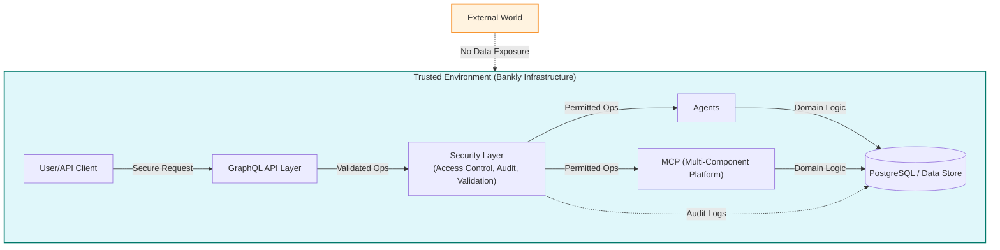
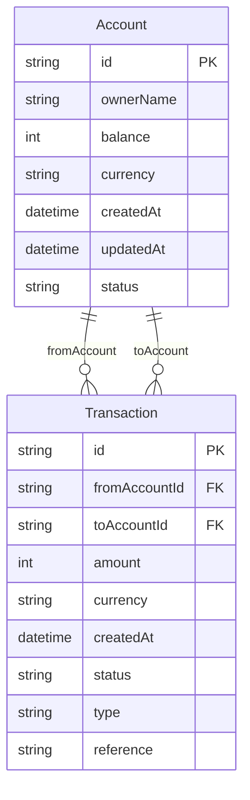
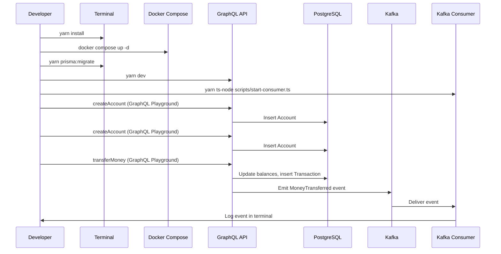
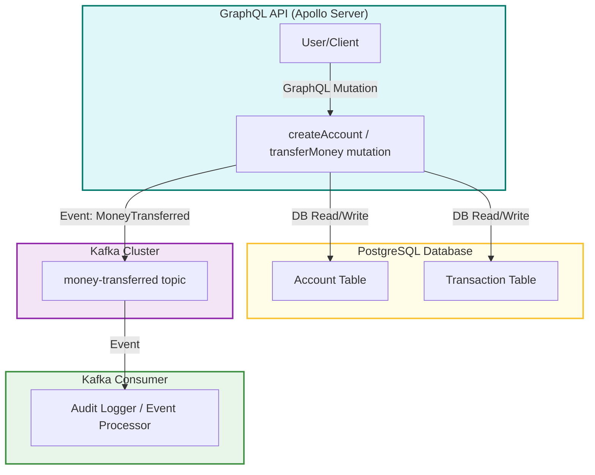

# 1. Bankly

> **AWP-Driven Project**  
> This project uses [Agentic Workflow Protocol](./awp.yml) as its single source of truth for all workflow, strategy, and progress tracking. The legacy PROJECT_STRATEGY.md has been fully replaced by the Agentic Workflow Protocol. This is a candidate for a new standard for collaborative, agentic, and transparent project management—machine- and human-readable, always in sync with code and docs.

**Version:** <!-- VERSION_PLACEHOLDER -->

Bankly is a self tech testing project, scaled up by strategic acceleration using a configured environment of multiple agents and MCP. The security layer ensures that using agents or MCP is not a security or GDPR risk: all sensitive data and operations remain within secure, controlled boundaries, with no external data exposure or unauthorized access. Agents and MCP operate only within the trusted environment, with strict access controls and auditability, so there is no risk of data leakage or non-compliance.

> **Note:** The security and GDPR guarantees described above apply when Bankly is deployed in a properly secured production environment. For local development or testing, always use mock or anonymized data and ensure your environment is configured to prevent unauthorized access or data leakage.



Built with Node.js, TypeScript, and functional programming principles using fp-ts, Bankly supports secure money transfers between user accounts, tracks transaction history, and publishes domain events via Kafka — all wrapped with robust CI/CD pipelines and comprehensive documentation.

## 1.1 Summary
Bankly is a functional, event-driven banking backend built with modern TypeScript, designed to demonstrate senior software engineering capabilities — from architecture and validation to event processing and CI/CD automation.

It simulates real-world financial use cases and shows expertise in building scalable, reliable, and testable back-end systems — suitable for fintech companies, startups, and enterprise APIs.

---
For a detailed roadmap and workflow, see [awp.yml](./awp.yml).
The project follows a modular, scalable structure for maintainability and growth.

## 2. Key Features

| Area                | Feature                                                                 |
|---------------------|-------------------------------------------------------------------------|
| 💼 Banking Domain   | Transfer money, validate accounts, and track balances                   |
| ✅ Functional Core  | Built using fp-ts, io-ts, and TaskEither for pure, composable logic     |
| 📦 GraphQL API      | Exposes typed operations with runtime validation                        |
| 🛢️ PostgreSQL + Prisma | ACID-safe persistence layer for accounts and transactions           |
| 📣 Kafka Events     | Emits MoneyTransferred events for external systems (logging, auditing, notifications) |
| 🔬 Testing Suite    | Includes unit tests, integration tests, and type-safe mocks             |
| ⚙️ CI/CD            | GitHub Actions pipeline with linting, tests, and build checks           |
| 📚 Documentation    | Full API schema, architectural overview, and event contracts            |
| 🛡️ Security Focus   | Immutable domain objects, strict type validation, no unsafe casting     |

## 5. Using the GraphQL API: Creating Accounts and Transferring Money

You can interact with Bankly's API using the built-in GraphQL Playground at [http://localhost:4000/](http://localhost:4000/).

### 5.1 Create Accounts
Use the following mutation to create an account:

```graphql
mutation {
  createAccount(ownerName: "Alice", balance: 1000, currency: "USD", status: "active") {
    id
    ownerName
    balance
    currency
    status
  }
}
```
Repeat for a second account (e.g., "Bob").

### 5.2 Get Account IDs
- The mutation response will include the new account's `id`.
- You can also view all accounts and their IDs using Prisma Studio:
  ```sh
  yarn prisma studio
  ```

### 5.3 Transfer Money
Use the real account IDs in the following mutation:

```graphql
mutation {
  transferMoney(
    fromAccountId: "REAL_ID_1"
    toAccountId: "REAL_ID_2"
    amount: 100
    currency: "USD"
  ) {
    transaction {
      id
      fromAccountId
      toAccountId
      amount
      currency
      createdAt
      status
      type
    }
    error
  }
}
```

### 5.4 Error Handling
- If you use invalid IDs, insufficient balance, or mismatched currencies, the API will return a helpful error message.

### 5.5 Health Check
Test the server with:
```graphql
query {
  _health
}
```

---

For more advanced usage, see the rest of this README and the schema in `src/index.ts`.

## 3. Technologies Used
- **Language:** Node.js + TypeScript
- **Functional Tools:** fp-ts, io-ts, zod
- **Database:** PostgreSQL (via Prisma ORM)
- **API Layer:** Apollo GraphQL Server
- **Messaging:** KafkaJS
- **CI/CD:** GitHub Actions + Docker
- **Testing:** Jest, Supertest, Fast-check
- **Architecture:** Hexagonal (Ports & Adapters), Domain-Driven Design

---

## 4. Architecture & Design Decisions

This project is a self technical test, designed to showcase my approach to building robust, maintainable, and scalable backend systems. Below, I explain the key architectural and design decisions:

### 4.1 Domain-Driven Design (DDD) & Hexagonal Architecture
- **Why:** DDD ensures the business logic is at the core, with clear boundaries and ubiquitous language. Hexagonal (Ports & Adapters) architecture decouples the domain from infrastructure, making the system testable and adaptable to change.
- **How:** All business rules are implemented in the domain layer, with adapters for persistence (PostgreSQL/Prisma), messaging (Kafka), and API (GraphQL).

### 4.2 Functional Programming with fp-ts
- **Why:** Functional programming (FP) brings composability, type safety, and predictability. fp-ts and io-ts enable pure business logic, error handling with TaskEither, and runtime validation.
- **How:** All core logic is written using fp-ts constructs, with no unsafe casting or mutation. Domain objects are immutable.

### 4.3 Type Safety & Validation
- **Why:** Financial systems require strong guarantees. TypeScript, io-ts, and zod provide both compile-time and runtime validation.
- **How:** All API inputs/outputs and domain events are validated at runtime, and types are enforced throughout the stack.

### 4.4 Event-Driven Design with Kafka
- **Why:** Event streaming enables real-time integrations, auditability, and decoupling of services.
- **How:** Money transfer operations emit `MoneyTransferred` events to Kafka, which can be consumed by external systems for logging, notifications, or analytics.

### 4.5 Testing & CI/CD
- **Why:** Reliability and confidence in changes are critical. Automated tests and pipelines catch issues early.
- **How:** The project includes unit tests, integration tests, and property-based tests (Fast-check). GitHub Actions run linting, tests, and build checks on every push.

### 4.6 Security
- **Why:** Banking systems must be secure by default.
- **How:** All domain objects are immutable, validation is strict, and no unsafe type assertions are used. Sensitive operations are protected by design.

### 4.7 Domain Model & Core Logic

#### Account
- **id**: Unique identifier (UUID or string)
- **ownerName**: Name of the account holder
- **balance**: Numeric value (integer, e.g., cents)
- **currency**: (optional, for multi-currency)
- **createdAt**: Timestamp
- **updatedAt**: Timestamp
- **status**: (optional, e.g., active, frozen, closed)

#### Transaction
- **id**: Unique identifier (UUID or string)
- **fromAccountId**: Reference to source account
- **toAccountId**: Reference to destination account
- **amount**: Numeric value (positive, in smallest currency unit)
- **currency**: (optional, for multi-currency)
- **createdAt**: Timestamp
- **status**: (pending, completed, failed, reversed)
- **type**: (transfer, deposit, withdrawal, etc.)
- **reference**: (optional, for external systems or audit)

#### transferFunds Logic
- **Inputs**: fromAccount, toAccount, amount
- **Validations**:
  - Both accounts exist and are active
  - Sufficient balance in fromAccount
  - Amount is positive and non-zero
  - (Optional) Currency matches
- **Effects**:
  - Debit fromAccount, credit toAccount
  - Create a Transaction record
  - Emit MoneyTransferred event
- **Error Handling**: Use fp-ts `Either` or `TaskEither` for functional error management

**All domain logic is pure and side-effect free. Side effects (DB, Kafka) are handled in adapters. Runtime validation is performed with io-ts or zod.**

#### Entity-Relationship Diagram



#### Prisma Schema (see prisma/schema.prisma)

```prisma
model Account {
  id         String        @id @default(uuid())
  ownerName  String
  balance    Int
  currency   String?
  createdAt  DateTime      @default(now())
  updatedAt  DateTime      @updatedAt
  status     String?
  sentTransactions     Transaction[] @relation("FromAccount")
  receivedTransactions Transaction[] @relation("ToAccount")
}

model Transaction {
  id            String   @id @default(uuid())
  fromAccount   Account  @relation("FromAccount", fields: [fromAccountId], references: [id])
  fromAccountId String
  toAccount     Account  @relation("ToAccount", fields: [toAccountId], references: [id])
  toAccountId   String
  amount        Int
  currency      String?
  createdAt     DateTime @default(now())
  status        String
  type          String
  reference     String?
}
```

### 4.8 Persistence Adapters
- **Why:** To ensure all database updates (such as money transfers) are atomic, ACID-compliant, and separated from business logic.
- **How:** All persistence operations are performed through adapters using Prisma transactions. This keeps the domain logic pure and side-effect free.
- **Where:** See `src/adapters/accountPersistence.ts` for the implementation of transaction-safe fund transfers.

---

## 5. Getting Started

### 5.1 Dependencies
Run the following to install all required dependencies (already listed in package.json):

```sh
yarn install
```

### 5.2 Project Structure
- Source code lives in the `src/` directory.
- The entry point is `src/index.ts`.
- Tests are placed in the `tests/` directory.
- Configuration files (non-env) go in the `config/` directory.

### 5.3 TypeScript Build
To compile the project:

```sh
yarn tsc
```

This will output compiled files to the `dist/` directory.

### 5.1 Local Testing User Story

As a developer, you can test the full flow locally as follows:

1. **Install all dependencies**
   ```sh
   yarn install
   ```
2. **Start required services (PostgreSQL, Kafka, Zookeeper)**
   ```sh
   docker compose up -d
   ```
3. **Run database migrations**
   ```sh
   yarn prisma:migrate
   ```
4. **Start the API server**
   ```sh
   yarn dev
   ```
   - The server will be available at [http://localhost:4000/](http://localhost:4000/).
5. **Start the Kafka consumer (in a separate terminal)**
   ```sh
   yarn ts-node scripts/start-consumer.ts
   ```
6. **Create two accounts using the GraphQL Playground**
   - Go to [http://localhost:4000/](http://localhost:4000/)
   - Run:
     ```graphql
     mutation {
       createAccount(ownerName: "Alice", balance: 1000, currency: "USD", status: "active") { id }
     }
     ```
     and
     ```graphql
     mutation {
       createAccount(ownerName: "Bob", balance: 1000, currency: "USD", status: "active") { id }
     }
     ```
   - Copy the returned `id` values.
7. **Transfer money between accounts**
   - Use the real IDs:
     ```graphql
     mutation {
       transferMoney(
         fromAccountId: "ID_OF_ALICE"
         toAccountId: "ID_OF_BOB"
         amount: 100
         currency: "USD"
       ) {
         transaction { id amount }
         error
       }
     }
     ```
8. **See the event in the consumer terminal**
   - You should see:
     ```
     [Kafka] Received event on topic money-transferred:
     {"fromAccountId":"...","toAccountId":"...","amount":100,...}
     ```

### Local Testing Flow Diagram



---

## 6. Documentation
- Full API schema, event contracts, and architectural diagrams will be provided as the project evolves.

---

## 7. Contributing
This project is a technical showcase and not open for external contributions at this time.

---

## 8. License
MIT

---

## 9. Commit Message Standard

This project uses the **Conventional Commits** standard for all commit messages. This enables automated changelogs, semantic releases, and a clear project history.

**Format:**
```
type(scope step): subject
```
- `type`: chore, feat, fix, docs, refactor, test, ci, build, etc.
- `scope`: (optional) area of codebase affected
- `step`: (required) the step from PROJECT_STRATEGY.md (e.g., 1.4.2)
- `subject`: short, imperative description

**Examples:**
- `feat(api 4.2): add money transfer mutation`
- `fix(domain 2.2): correct balance calculation`
- `chore(setup 1.4.2): add ESLint and Prettier config`
- `docs(readme 9.1): add architecture diagram`

**Rules:**
- Reference the step being followed in PROJECT_STRATEGY.md in every commit.
- Use lower case and imperative mood for the subject.
- Keep messages concise and descriptive.

**Why?**
- Enables automated changelogs and semantic releases
- Makes git history easier to read and search
- Encourages clear, consistent communication
- Ensures traceability to project strategy steps

For more details, see [Conventional Commits](https://www.conventionalcommits.org/).

## 6. Kafka Integration: Emitting and Consuming Events

Bankly emits a `MoneyTransferred` event to Kafka after every successful money transfer. This enables event-driven integrations, audit logging, and more.

### 6.1 Running Kafka Locally
Kafka and Zookeeper are provided via Docker Compose:

```sh
docker compose up -d
```

### 6.2 Event Emission
After a successful `transferMoney` mutation, an event is published to the `money-transferred` topic. The event payload includes:
- `fromAccountId`
- `toAccountId`
- `amount`
- `currency`
- `transactionId`
- `timestamp`

### 6.3 Consuming Events
A simple Kafka consumer is provided to log these events:

```sh
yarn ts-node scripts/start-consumer.ts
```

You should see output like:
```
[Kafka] Received event on topic money-transferred:
{"fromAccountId":"...","toAccountId":"...","amount":100,...}
```

### 6.4 Testing the Integration
1. Start your app (`yarn dev`).
2. Start the consumer as above.
3. Perform a `transferMoney` mutation via GraphQL Playground.
4. Watch the consumer terminal for the event log.

---

## 7. System Architecture Diagram



This diagram shows how users interact with the API, how the API reads/writes to the database, emits events to Kafka, and how consumers process those events for further use (e.g., audit logging).

---
