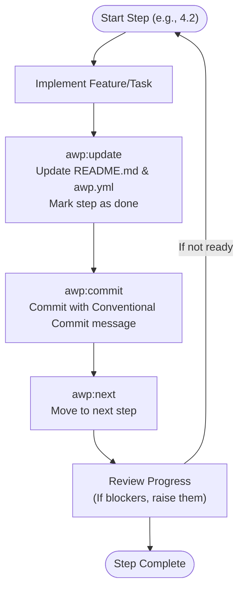
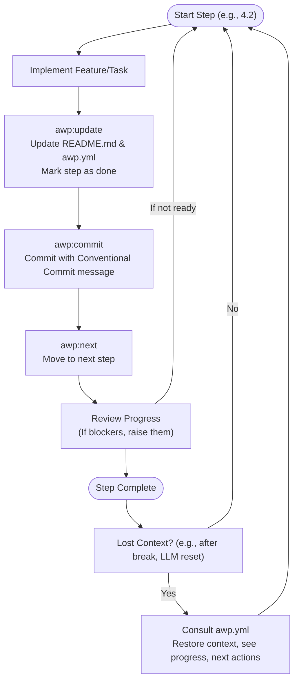

# 🚀 Agentic Workflow Policy (AWP)

**Open Source Standard Candidate**

**Maintained by Community**, Author: [Michael Wybraniec](https://michaelwybraniec.com)

**Mission:** Empower teams and agents to build, track, and document projects with clarity, transparency, and flow.

**Quickstart:**
1. Copy a template from below to your project as `awp.yml`.
   
2. Edit the header, goal, and steps for your project.
3. Track your progress and let AWP hold YOU and LLM while vibe coding!

## 📚 Table of Contents
- [🚀 Agentic Workflow Policy (AWP)](#-agentic-workflow-policy-awp)
  - [📚 Table of Contents](#-table-of-contents)
  - [🌟 What is AWP?](#-what-is-awp)
  - [🏷️ Key Terms](#️-key-terms)
  - [🔄 AWP Workflow Examples](#-awp-workflow-examples)
  - [🧠 Handling Memory Loss or Returning to Work (Diagram)](#-handling-memory-loss-or-returning-to-work-diagram)
  - [🗂️ AWP File Structure Explained](#️-awp-file-structure-explained)
  - [🛠️ How to Use AWP in Your Project](#️-how-to-use-awp-in-your-project)
  - [💡 Best Practices](#-best-practices)
  - [📦 Example Templates](#-example-templates)

## 🌟 What is AWP?

**Agentic Workflow Policy (AWP)** is a candidate for the new standard in transparent, agentic, and collaborative project management. Use this documentation and the templates to get started, and help shape the future of hybrid human-agent vibe-coding! AWP is designed for both solo developers and teams (including AI agents), ensuring everyone stays in sync, code and docs are always aligned, and progress is transparent.

---

## 🏷️ Key Terms

**VIBE-CODING**
> A state of creative, uninterrupted coding flow, where you (and optionally your agent) are fully immersed in building, iterating, and shipping features. AWP helps you stay in this flow by keeping your roadmap and progress tracking frictionless and always up to date.

**OVER-VIBING**
> This is when you let your agent work for you too much, and then it forgets the context due to network or LLM limitations. It can lead to overlooking the context, and/or losing track of the project's progress, architecture, or complexity.

**AWP**
> AWP is designed to prevent over-vibing by making project strategy, progress, actions, and procedures always visible and reviewable for humans.

---

## 🔄 AWP Workflow Examples

Below is a visual representation of the standard AWP workflow for each step:



---

## 🧠 Handling Memory Loss or Returning to Work (Diagram)

AWP helps you or your agent recover context after a break, LLM reset, or network issue. Here's how:



---

## 🗂️ AWP File Structure Explained

> **The `awp.yml` file is your project's living roadmap.**

| Section         | Purpose                                                      |
|-----------------|-------------------------------------------------------------|
| **Header/Metadata** | Human context, author, contact info                    |
| **author**          | Main author/maintainer                                 |
| **goal**            | Project's main objective                               |
| **overview**        | High-level project phases                              |
| **outcome**         | Intended final result                                  |
| **steps**           | Hierarchical, numerated checklist of all steps         |
| **procedures**      | Core workflow actions (update, commit, next)           |
| **notes**           | Reminders and project-wide policies                    |
| **commitStandard**  | Commit message format, rules, and examples             |

**Example snippet:**
```yaml
steps:
  - number: 1
    name: "Setup & Tooling"
    steps:
      - number: 1.1
        description: "Initialize project with yarn init -y"
        done: true
      - number: 1.2
        description: "Add .gitignore and README.md"
        done: true
```

---

## 🛠️ How to Use AWP in Your Project

1. **Copy a template** (or start from scratch) and place it in your project root as `awp.yml`.
2. **Edit the header**: Add your name, organization, and contact info.
3. **Define your goal and outcome**: Clearly state what your project aims to achieve.
4. **List your main steps** in the `overview` and break them down in the `steps` section. Use hierarchical numbering (1., 1.1, 2.1, etc.).
5. **Track progress**: Mark steps as done as you complete them.
6. **Follow the commitStandard**: Every commit should reference the relevant step and follow the agreed format.
7. **Use the procedures**: After each step, run `awp:update`, `awp:commit`, and `awp:next` to keep everything in sync.
8. **Collaborate**: Share your AWP file with teammates or agents. Everyone can see what's done, what's next, and how to contribute.
9. **Iterate**: Update your AWP as your project evolves. It's your living workflow document.

> 💡 **Tip:**  
> Always keep your AWP file up to date—especially after agentic work or long coding sessions. This ensures you (and your LLM) never lose context or progress!

---

## 💡 Best Practices

- Keep your `awp.yml` file in the project root for easy discovery.
- Use clear, actionable descriptions for each step.
- Update your AWP after every meaningful change.
- Reference the step number in every commit for traceability.
- Review and refine your workflow regularly—AWP is meant to evolve with your project.

---

## 📦 Example Templates

- **`awp1.yml`**: Node.js CLI Tool
- **`awp2.yml`**: Flask REST API
- **`awp3.yml`**: React Web App
- **`awp4.yml`**: Data Science Notebook
- **`awp5.yml`**: DevOps Automation (GitHub Actions)

---

**AWP is a candidate for the new standard in transparent, agentic, and collaborative project management. Use this documentation and the templates to get started, and help shape the future of hybrid human-agent vibe-coding!**
