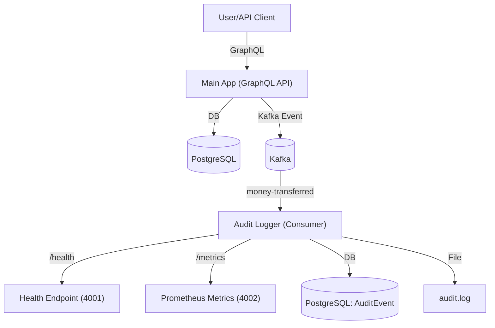

# System Architecture

This project is a production-grade, event-driven banking backend, designed for auditability, observability, and microservice readiness.

## Overview
- **Main App:** GraphQL API for accounts and transactions
- **Database:** PostgreSQL (via Prisma)
- **Event Bus:** Kafka (money-transferred events)
- **Audit Logger:** Kafka consumer, logs to DB and file, exposes health and metrics endpoints
- **CI/CD:** Automated via GitHub Actions
- **Metrics & Health:** Prometheus metrics and health endpoints for all services

## Event Flow Diagram

## Microservice Readiness
- Each service can be run, deployed, and monitored independently
- Health and metrics endpoints for observability
- Dockerfile for containerization
- CI/CD pipeline for automated testing and deployment

## AWP Alignment
- **Step 6:** Audit logger as a microservice
- **Step 7:** CI/CD pipeline
- **Step 8:** Automated and property-based tests
- **Step 10.5:** Metrics, dashboards, and alerting
